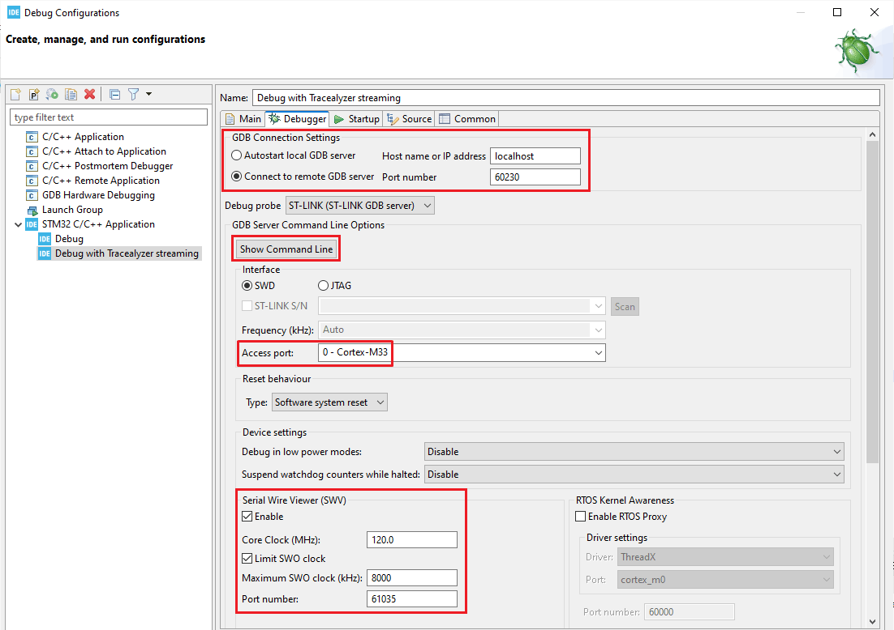

# Tracealyzer streaming with STLINK v3

This example project shows how to use [Percepio Tracealyzer](https://percepio.com/tracealyzer)
together with STM32CubeIDE and STLINK v3 to stream [TraceRecorder](https://github.com/percepio/TraceRecorderSource) 
data with good performance on STM32 microcontrollers. In our experiments, the STLINK v3 has allowed for
reliable performance at 8 MHz SWO clock speed, enabling data rates close to 800 KB/s.

Percepio TraceRecorder is the target-side library for Tracealyzer and supports tracing of various real-time operating systems such as FreeRTOS,
ThreadX and Zephyr, as well as bare metal applications.

This demo project focuses on the STLINK streaming performance and is not intended to demonstrate
the full capabilities of Tracealyzer. Check the [Tracealyzer product page](https://percepio.com/tracealyzer) for more information.

The demo project targets the [B-U585I-IOT02A](https://www.st.com/en/evaluation-tools/b-u585i-iot02a.html) board. However, the setup can be used for other STM32 devices as well, assuming the ITM unit and SWO output is included. This is typically the case on STM32 boards based on Arm Cortex-M3, M4, M7, M33 cores or above. ITM is usually not supported on Arm Cortex-M0/M0+ devices. 

The older STLINK v2 is also supported by this solution, but this only supports up to 2 MHz SWO speed, which is usually not sufficient for RTOS tracing.

If you have questions about this solution, [contact Percepio here](https://percepio.com/contact-us/).

## Prerequisites

- Percepio Tracealyzer, [available for evaluation here](https://percepio.com/tracealyzer/download-tracealyzer/).
  Tracealyzer supports Windows and Linux, but not yet macOS.
- STM32CubeIDE
- Python
- An STM32 board with an STLINK v3 debugger, for example [B-U585I-IOT02A](https://www.st.com/en/evaluation-tools/b-u585i-iot02a.html).

## Setup

1. TraceRecorder is already integrated in this demo project, but to replicate the setup on your own project,
   follow the guide on [Tracealyzer Getting Started](https://percepio.com/tracealyzer/gettingstarted) matching your RTOS.
   Use the **ARM_ITM** streamport module. 
   
   There is only one-way communication in this setup, so you need to start the tracing using xTraceEnable(TRC_START).
   Starting and stopping TraceRecorder from the Tracealyzer application is normally possible, but not implemented here.
   
&nbsp;

   
2. Open **Debug Configurations** in STM32CubeIDE and create a new entry.
   
   Set a suitable name, for example "Debug with Tracealyzer streaming".
   
&nbsp;

   
   2.1. On the **Debugger** page, enter the following configuration:
   
   
   
   Under **GDB Connection Settings**
   - Connect to remote GDB server: Checked
   - Host name or IP address: localhost
   - Port number: 60230
   
   

      
   Under **Serial Wire Viewer (SWV)**
   - Serial Wire Viewer: Enabled
   - Core clock: (your core clock speed)
   - Limit SWO clock: Checked
   - Maximum SWO clock (KHz): 8000
   - Port number: 61035

   

   
   Note: The default port numbers suggested above might not be availble on all computers, i.e. if used by other applications.
   Such errors will be logged in **trace_error.log**. In that case, the port numbers can be changed in **settings.py**.
   See the Troubleshooting section in the end.
   
&nbsp;

   
   2.2. Click the **Show Command Line** button.
	     
   
		 
   Copy the path to the STLINK GDB server. Open **settings.py** and update **GDB_SERVER_PATH**.
   Make sure to keep the special python formatting (GDB_SERVER_PATH = r'path').
		 
   
		 
   Also copy the second path (the STLINK programmer tool directory) and update **STLINK_PROG_DIR** in settings.py.
   Save your updated settings.py.
   
&nbsp;

  
   2.3. On the **Startup** page, add the following in the **Run Commands** field.
    
   - On Windows: "shell start /b python swo-reader-tcp.py"
	
   - On Linux: "python3 swo-reader-tcp.py &"
   
   (Don't include the quotation marks!)
		 
     
   
&nbsp;

   
3. Next step is to add the GDB server script as an "External Tool" in STM32CubeIDE.
   
   - Locate the "External Tools" dropdown menu and select External Tools Configuration.
   
     
	 
   - Set a suitable name, e.g. "GDB server with trace output".	 
   
       
	    
   - Under "Location", select "Browse Workspace" and select the right script file:
   
     If using Windows: **stm32cubeide_external_tool_start_gdb_server.bat**
   
     If using Linux: **stm32cubeide_external_tool_start_gdb_server.sh**     
	 
   - Under "Working Directory", select your project root folder.
   
   - On the "Build" page, you may disable "Build before launch".
   
   - Apply and close.
   
&nbsp;

   
4. To test the new debugging setup, two steps are needed with this approach:
 
   - Start the **GDB server**, using your new "external tool" shortcut.
  
   - Start your new Debug Configuration using the **Debug button**. 
     The first time, make sure to launch the right Debug Configuration by selecting it from the dropdown menu.
	 Clicking the Debug button will launch the latest used configuration.
	
       
     

   
   Make sure your debugging works as expected, i.e. stepping, breakpoints and so. 
   The GDB server window can be minimized, but closing it will kill your debug session.
   
&nbsp;

   
5. Inside your debug session, open **SWV Trace Log** (see Show View -> SWV).
   
   
   
   
&nbsp;

6. Click on the **Configure trace** button.

   Enable ITM port 1. Disable everything else. 
   
   Click OK.
      
   
   
   
&nbsp;

7. In **SWV Trace Log**, use the **Start Trace** button to enable trace output on your device.
   
   
   
   
&nbsp;

   
8. Close the debug session. The settings are stored in your project.

   
&nbsp;

   
9. Open Tracealyzer and go to **File** -> **Settings**.
   - Select **PSF Streaming Settings**
   
     
   
   - Target Connection: TCP
   - TCP address: 127.0.0.1 (your local computer)
   - Port: 5000
   - Data is ITM encoded: Checked
   
   Leave the other options unchecked/empty. Press OK.
   
   
&nbsp;

   
## Usage

   1. Start the GDB server using the "External Tool" shortcut. This opens a terminal window. Avoid closing this window manually.
         	  
   2. Click the Debug button to launch your debug configuration.
      But let it remain halted for now.
      
   3. In Tracealyzer, open the **Trace** menu and select **Open Live Stream Tool**.
      
	  Check the "Disable Live Visualization" checkbox if you want to record long traces, i.e. for more than a few minutes.
	  This reduces the risk of Missed Events (see Troubleshooting below).
      
	  Then click **Connect** and **Start Session**.
	  
	  
	  

	        
   4. Start the target system in STM32CubeIDE. When Tracealyzer is recording data, 
      check the Live Stream window for a notice about "Missed events".
      If this notice shows up, follow the advice in the "Troubleshooting" section below.
	  Tracealyzer needs a complete data stream to ensure correct display of the trace.
	  
	  
	  
   5. Stop the trace session to load the trace data into Tracealyzer and enable all views.
      
	  If the trace is very large, you will be asked to open it in the Trace Preview. This opens quickly
	  and lets you select a smaller section of relevance to limit the amount of loaded data.
	  
   Note: You can generate higher data rates for stress-testing the solution by reducing the value
   of **throttle_delay** in main.c. Setting it to 0 results in maximum data rate.

## Troubleshooting:

### GDB Server Issues

 If the terminal window closes right away, it is probably because another instance is still open.
 Close all previous windows and try again.
   
 If you see an error like "Error in initializing ST-LINK device. Reason: ST-LINK DLL error."
 this might be because the previous GDB server instance was closed down abruptly, e.g. manually closing the terminal window.
 In this case, wait a minute and try again.

 If you have other issues, check for a log file named **trace_error.log** and inspect
 the error message there. 
 
 It might be that some of the default port numbers are already in use. The TCP socket "bind" operation then fails, which is logged to trace_error.log.
 In this case, open **settings.py** and try a different port number for the port setting mentioned in the error message.
 Make sure to read the associated comments for the port settings. Most have corresponding settings in "the other end" that also needs to be updated, i.e. in the STM32CubeIDE debug
 configuration or in the Tracealyzer settings.

### Missed Events
 Missed events are detected and reported by Tracealyzer. In case you see Missed Events, make sure
 to resolve such issues before studying the traces in Tracealyzer, otherwise the displayed data might not be correct.

 There seem to be two main reasons for missed events when using this approach:
 
 1. **Too high SWO frequency:** 7-9 MHz seems reliable, but in our experiments STM32CubeIDE
 selected 12 MHz by default (core clock divided by 10) which resulted in occational missed
 events also at lower event rate. It is recommended to select "Limit SWO frequency" and specify
 a lower value, for example 8 MHz.
 
 2. **Too high host-side system load:** Depending on the performance and load on your host
 computer, it seems there can be occational overflows in the (pretty small) SWO buffer in the
 STLINK GDB server. For example, if using live visualization combined with high data rate,
 on a somewhat slow computer.
 
 If you see a small number of occational Missed Events, i.e. increments of 1 (or a few), 
 while the data rate is low (say, below 250 KB/s), it is probably a transmission error due to using
 too high SWO frequency. This is especially likely if using an SWO frequency is high, above 8 MHz. 
 In that case, try reducing the SWO frequency in steps of 500 Khz until no Missed Events occur.
 You find this setting in your STM32CubeIDE Debug Configuration on the "Debugger" page ("Limit SWO clock").
 
 If you see larger increments in the Missed Events, where the counter suddenly jumps by tens or
 hundreds of missed events, it is probably due to the host-side overflow issue. In this case, 
 it is recommended to disable live visualization in Tracealyzer. Select **Open Live Stream Tool** in the **Trace** menu and enable the checkbox
 **Disable Live Visualization** before connecting and starting the session.
 
 Disabling Live Visualization is usually sufficient, but you can also try the following:
 
 - Close any other open applications that isn't needed at the moment.

 - Reduce the scheduling priority of the Tracealyzer application. This can allow for Live Visualization without missed events also at high data rates.

 - Reduce the data rate from TraceRecorder using the settings in trcConfig.h.
   For example, tracing of OS Tick events is usually redundant and can be disabled.
   Also, if you added custom events like tracing interrupt handlers or "User Events"
   in frequently executed code, you can try commenting them out.

 - Reduce the SWO frequency to ensure there is no transmission errors.
 
 - Try using a faster computer.
 
 - Also see the troubleshooting guide in the Tracealyzer User Manual (Help menu).

## How this solution works

 The SWO data is provided by the STLINK GDB server on a TCP port, but
 STM32CubeIDE will normally connect to this port and consume all data.

 This solution therefore starts the GDB server with a different SWO port
 number, that STM32CubeIDE is not aware of. To avoid a TCP connection error
 in STM32CubeIDE, the solution also provides a "dummy" TCP port that is
 specified as SWO port in the STM32CubeIDE debug configuration. Otherwise
 the connection error is STM32CubeIDE will disable the SWO output.
 
 A second python script ("swo-reader-tcp.py") connects to the GDB server's
 SWO port and reads the data into a queue. Another thread reads the queue
 and send the data to Tracealyzer using a different TCP socket. This made
 the solution a lot more reliable.

## Questions?

 If you have questions about this solution, [contact Percepio here](https://percepio.com/contact-us/).

Copyright (c) Percepio AB.
